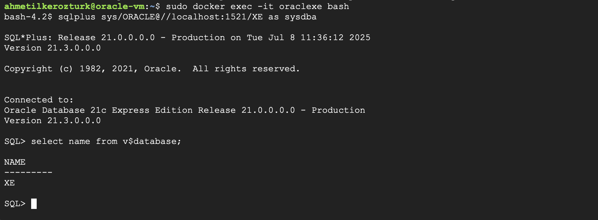

# Oracle Database 21c Express Edition on Docker

This guide shows how to quickly set up **Oracle Database 21c XE** in a Docker container and connect to it using SQL*Plus.  
Everything is done on a cloud VM (GCP/AWS), but you can also do it locally.

---

##  Steps to Run Oracle XE in Docker

### 1. Clone Oracle’s Official Docker Images

Clone the Oracle Docker images repository and go to the required folder:

```bash
git clone https://github.com/oracle/docker-images.git
cd docker-images/OracleDatabase/SingleInstance/dockerfiles
```

### 2. Build the Oracle XE Docker Image

Build the Docker image for Oracle XE (this will take a while):
```bash
sudo ./buildContainerImage.sh -v 21.3.0 -x
```
Tip: Make sure your VM has at least 13GB of free disk space.

### 3. Start the Oracle XE Container

Run the Docker container with a password of your choice (here: ORACLE):
```bash
sudo docker run -d --name oraclexe -p 1521:1521 -p 5500:5500 -e ORACLE_PWD=ORACLE oracle/database:21.3.0-xe
```

### 4. Check That the Container is Running

You can see running containers with:
```bash
sudo docker ps
```

### 5. Connect to Oracle with SQL*Plus

Open a bash shell in your running container:
```bash
sudo docker exec -it oraclexe bash
```
Start SQL*Plus and connect as sysdba:
```bash
sqlplus sys/ORACLE@//localhost:1521/XE as sysdba
```

### 6. Verify the Database

Run a test SQL query to check that the database is up:
```bash
select name from v$database;
```

## 📸 Screenshot

Below is a screenshot showing the successful SQL*Plus connection and test query:




